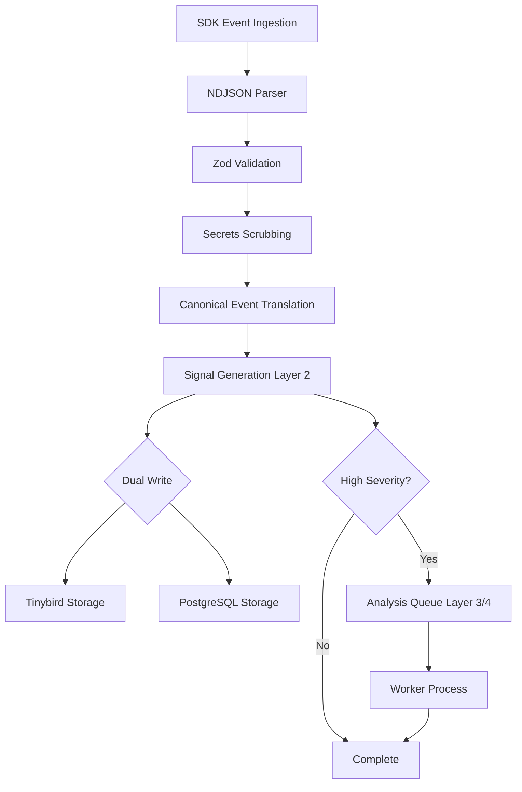

# Platform Capabilities & Technical Overview

Complete technical overview of the Observa platform, showcasing our technology stack, security architecture, database design, and advanced capabilities.

---

## Executive Summary

Observa is built on a modern, enterprise-grade architecture designed for scale, security, and reliability. Our platform leverages cutting-edge technologies and industry best practices to deliver a robust observability solution for AI applications.

**Key Differentiators:**
- **Dual-Database Architecture**: PostgreSQL for control plane, Tinybird (ClickHouse) for analytics
- **Multi-Layer Security**: Defense-in-depth with authentication, authorization, and data protection
- **Serverless-First**: Auto-scaling infrastructure on Vercel
- **Event-Driven Analysis**: Intelligent signal detection with cost-efficient processing
- **Enterprise Security**: Per-tenant isolation, secrets scrubbing, audit logging

---

## Technology Stack

### Runtime & Language
- **Node.js**: Latest LTS version for stability and performance
- **TypeScript**: Full type safety with strict mode enabled
- **ES Modules**: Modern JavaScript module system
- **Why**: Type safety prevents runtime errors, modern tooling improves developer experience

### Framework & Libraries
- **Express.js**: Battle-tested web framework
- **Zod**: Runtime type validation and schema definition
- **bcryptjs**: Secure password hashing
- **jsonwebtoken**: JWT token generation and validation
- **BullMQ**: Distributed job queue system
- **ioredis**: Redis client for job queues
- **pg**: PostgreSQL client with connection pooling
- **Why**: Mature, well-maintained libraries with strong community support

### Development Tools
- **tsx**: TypeScript execution with hot reload
- **TypeScript Compiler**: Strict type checking
- **Swagger/OpenAPI**: API documentation generation
- **Why**: Fast development iteration, comprehensive documentation

### Deployment & Infrastructure
- **Vercel Serverless Functions**: Auto-scaling, edge deployment
- **Neon PostgreSQL**: Serverless Postgres with connection pooling
- **Tinybird**: ClickHouse-based analytics platform
- **Upstash Redis**: Serverless Redis for job queues
- **Sentry**: Error monitoring and performance tracking
- **Why**: Serverless architecture eliminates infrastructure management, auto-scales to zero, reduces costs

---

## Database Architecture

### Dual-Database Strategy

We use a **dual-database architecture** that separates operational data from analytics data, optimizing for both transactional integrity and analytical performance.

#### PostgreSQL (Control Plane)

**Purpose**: Operational data, user management, configuration

**Why PostgreSQL:**
- ACID compliance for data integrity
- Complex relational queries
- Transaction support
- Foreign key constraints
- Mature ecosystem

**Provider**: Neon (Serverless PostgreSQL)
- Automatic scaling
- Connection pooling
- SSL encryption
- Cold start optimization
- Branching for development

**Schema Highlights:**
- **Tenants**: Multi-tenant isolation
- **Projects**: Environment separation (dev/prod)
- **Users**: Authentication and authorization
- **Sessions**: Secure session management
- **API Keys**: Scoped key management (server/publishable)
- **Analysis Results**: ML analysis storage
- **Conversations**: Message grouping
- **User Sessions**: Browser/app session tracking
- **Audit Logs**: Complete action history

**Performance Optimizations:**
- Comprehensive indexing strategy
- Composite indexes for common queries
- NULLS LAST for efficient filtering
- Connection pooling (20 max connections)
- Prepared statements
- Batch operations

#### Tinybird (Analytics Data Plane)

**Purpose**: Time-series event data, real-time analytics

**Why Tinybird/ClickHouse:**
- Columnar storage for analytical queries
- Sub-second query performance on billions of rows
- Automatic partitioning
- Time-series optimization
- Real-time ingestion
- Cost-effective at scale

**Features:**
- Per-tenant token isolation
- Automatic data partitioning
- Materialized views for common queries
- Real-time data ingestion
- SQL-like query language

**Datasources:**
- **traces**: Legacy trace events
- **canonical_events**: Standardized event format

**Use Cases:**
- Dashboard metrics (latency, error rates, costs)
- Trace queries
- Signal queries
- Time-series analytics
- Real-time aggregations

---

## Security Architecture

### Multi-Layer Defense Strategy

We implement defense-in-depth security with multiple layers of protection.

#### Authentication & Authorization

**Dual API Key System:**
- **Server Keys** (`sk_` prefix): Full access, backend use only
- **Publishable Keys** (`pk_` prefix): Limited access, frontend use with origin restrictions
- **Scopes**: `ingest` and `query` permissions
- **Origin Restrictions**: Publishable keys restricted to specific domains
- **Key Rotation**: Support for key revocation and rotation

**JWT-Based Authentication:**
- Secure token generation with configurable expiration (default: 90 days)
- SHA-256 token hashing for storage
- Token validation with caching (5-minute TTL)
- Automatic token expiration

**Session Management:**
- Secure session tokens
- 90-day session expiry
- Session invalidation on logout
- Cache-based session validation
- Database-backed session storage

**Password Security:**
- bcryptjs with 10 salt rounds
- Password hashing on registration
- Secure password comparison
- No plaintext password storage

**Per-Tenant Token Isolation:**
- Each tenant receives unique Tinybird token
- Database-level tenant isolation
- Query-level tenant filtering
- Prevents cross-tenant data access

#### Security Middleware

**Helmet.js Security Headers:**
```javascript
- Content Security Policy (CSP)
- HSTS with preload (1 year, includeSubDomains)
- X-Frame-Options: DENY
- X-Content-Type-Options: nosniff
- X-XSS-Protection: 1; mode=block
- Referrer-Policy: strict-origin-when-cross-origin
```

**Rate Limiting:**
- 100 requests per 15 minutes per IP
- Trust proxy configuration for Vercel
- X-Forwarded-For header handling
- Per-tenant rate limiting support
- Graceful degradation on rate limit errors

**CORS Configuration:**
- Configurable allowed origins
- Credentials support
- Method restrictions (GET, POST, DELETE)
- Header restrictions
- 24-hour preflight cache

**Request Size Limits:**
- 10MB payload limit
- Prevents DoS via large payloads
- Configurable per endpoint

#### Data Protection

**Secrets Scrubbing Service:**
Automatic detection and redaction of sensitive data:
- OpenAI API keys (`sk-*`)
- AWS access keys (`AKIA*`)
- AWS secret keys
- GitHub tokens (`ghp_*`)
- Bearer tokens
- Email addresses (configurable)
- Credit card numbers
- Social Security Numbers (SSN)

**SQL Injection Prevention:**
- Parameterized queries exclusively
- UUID format validation
- Input sanitization
- No string concatenation in SQL

**Tenant Isolation:**
- Enforced at database level (foreign keys)
- Enforced at query level (WHERE clauses)
- Tenant ID validation (UUID format)
- Cross-tenant query prevention

**Audit Logging:**
- Complete action history
- User ID tracking
- IP address logging
- User agent tracking
- Resource type and ID tracking
- Metadata storage (JSON)

#### Environment Security

**Environment Variable Validation:**
- Zod schema validation at startup
- Required variable enforcement
- Type checking
- URL validation
- Minimum length requirements
- Graceful error messages

**Secret Management:**
- No hardcoded secrets
- Environment variable storage
- Vercel environment variable management
- Separate dev/prod configurations

**SSL/TLS:**
- Enforced for all database connections
- SSL certificate validation
- Encrypted data in transit

---

## Observability & Monitoring

### Error Tracking

**Sentry Integration:**
- Real-time error monitoring
- Error context and stack traces
- Performance monitoring (10% transaction sampling)
- Profiling integration (10% profile sampling)
- Environment tagging
- Request ID correlation
- Custom tags and metadata
- Release tracking

**Error Handling:**
- Structured error responses
- Error codes and messages
- Request ID in all errors
- Stack traces in development only
- Error logging with context

### Request Tracking

**Request ID Middleware:**
- Unique ID per request
- UUID-based generation
- Included in all logs
- Included in error responses
- Traceability across services

**Structured Logging:**
- JSON-formatted logs
- Request context
- Timestamp tracking
- Log levels (info, warn, error)

### Health Monitoring

**Health Check Endpoints:**
- `/health`: Basic health check
- `/health/detailed`: Comprehensive health check
  - Database connection status
  - Redis connection status
  - Tinybird connection status
  - Schema initialization status

**Version Endpoint:**
- Git commit SHA
- Deployment ID
- Environment information
- Node.js version
- Build timestamp

**Diagnostics Endpoint:**
- Environment variable status
- Connection status
- Configuration validation
- System information

### Metrics

**System Metrics:**
- Tenant count
- Project count
- API key count
- Active session count
- Database connection pool status

**Business Metrics:**
- Trace count
- Event count
- Quality scores
- Error rates
- Success rates

**Performance Metrics:**
- Latency percentiles (P50, P95, P99)
- Throughput
- Error rates
- Queue statistics

---

## Performance & Scalability

### Database Optimization

**Connection Pooling:**
- pg Pool with 20 max connections
- Idle timeout (30 seconds)
- Connection timeout (30s for Neon, 10s for others)
- Automatic connection retry
- Graceful connection cleanup

**Query Optimization:**
- Comprehensive indexing strategy
- Composite indexes for common queries
- NULLS LAST for efficient filtering
- Prepared statements
- Batch operations
- Query result caching

**Connection Retry Logic:**
- Exponential backoff (2s, 4s, 6s)
- 3 retry attempts
- Neon cold start handling
- Timeout detection

### Caching Strategy

**Session Caching:**
- In-memory cache with 5-minute TTL
- Token hash as cache key
- Automatic cache cleanup (every 10 minutes)
- Cache poisoning prevention
- Fallback to database on cache miss

**Cache Security:**
- Token hash validation
- Cache entry expiration
- Automatic cleanup of expired entries

### Async Processing

**Job Queue (BullMQ):**
- Redis-backed distributed queue
- Exponential backoff retry (2s, 4s, 8s)
- Job prioritization
- Automatic cleanup:
  - Completed jobs: 24 hours
  - Failed jobs: 7 days
- Job deduplication
- Graceful degradation if Redis unavailable

**Worker Process:**
- Separate worker process for analysis jobs
- Independent scaling
- Graceful shutdown handling
- SIGTERM/SIGINT support

**Background Processing:**
- Non-blocking analysis jobs
- Event-driven triggers
- Cost-efficient processing

### Serverless Optimization

**Cold Start Handling:**
- Schema initialization with timeouts
- Connection pooling for serverless
- Background initialization
- Graceful degradation

**Connection Reuse:**
- Connection pooling across invocations
- Persistent connections where possible
- Automatic reconnection

**Background Processing:**
- Non-blocking operations
- Queue-based processing
- Async/await patterns

---

## Data Processing Architecture

### Event Processing Pipeline



**Pipeline Stages:**

1. **Ingestion**: NDJSON parser for batch events
2. **Validation**: Zod schema validation
3. **Secrets Scrubbing**: Automatic PII/secret detection
4. **Canonical Event Translation**: Legacy to canonical format
5. **Signal Generation**: Layer 2 deterministic signals
6. **Storage**: Dual write to Tinybird and PostgreSQL
7. **Analysis Queue**: Event-driven analysis for high-severity signals

### Multi-Layer Analysis System

**Layer 1: Raw Event Storage**
- 100% of events stored
- Complete event history
- Time-series data

**Layer 2: Deterministic Signals (100% Coverage)**
- Latency thresholds (p95/p99 by route/model)
- Error rate by tool/model/version
- Loop detection
- Token/cost spikes
- Secret detection
- Tool timeout detection

**Layer 3: Semantic Signals (Sampled)**
- Embedding-based similarity
- Semantic search
- Quality scoring
- Cost-efficient processing

**Layer 4: LLM Judges (High-Severity Only)**
- Hallucination detection
- Quality assessment
- Context relevance
- Faithfulness scoring
- Only triggered for high-severity signals

**Why This Architecture:**
- Cost-efficient: Expensive analysis only when needed
- Scalable: Deterministic signals on 100% of events
- Intelligent: Event-driven triggers
- Fast: Real-time signal generation

---

## API Design & Documentation

### RESTful API

**Versioning:**
- `/api/v1/` prefix
- Semantic versioning
- Backward compatibility

**OpenAPI/Swagger:**
- Complete API documentation
- Interactive API explorer
- Request/response examples
- Authentication documentation
- Error code reference

**Error Handling:**
- Structured error responses
- Error codes
- Error messages
- Request ID tracking
- Development vs production error detail

**Request Validation:**
- Zod schemas for all inputs
- Type checking
- Format validation
- Required field enforcement

### API Endpoints

**Authentication:**
- `POST /api/v1/auth/login` - User login
- `POST /api/v1/auth/signup` - User registration
- `POST /api/v1/auth/logout` - Session invalidation
- `GET /api/v1/auth/me` - Current user info

**Events:**
- `POST /api/v1/events/ingest` - Event ingestion (SDK)
- `GET /api/v1/events` - Event query

**Traces:**
- `GET /api/v1/traces` - List traces
- `GET /api/v1/traces/:id` - Get trace details
- `GET /api/v1/traces/:id/events` - Get trace events

**Dashboard:**
- `GET /api/v1/dashboard/overview` - Dashboard overview
- `GET /api/v1/dashboard/metrics` - Dashboard metrics
- `GET /api/v1/dashboard/latency` - Latency metrics
- `GET /api/v1/dashboard/errors` - Error metrics
- `GET /api/v1/dashboard/costs` - Cost metrics

**Analytics:**
- `GET /api/v1/analytics/*` - Analytics endpoints

**Issues:**
- `GET /api/v1/issues` - List issues
- `GET /api/v1/issues/:id` - Get issue details
- `GET /api/v1/issues/summary` - Issue summary

**Costs:**
- `GET /api/v1/costs` - Cost analytics
- `GET /api/v1/costs/breakdown` - Cost breakdown

**Conversations:**
- `GET /api/v1/conversations` - List conversations
- `GET /api/v1/conversations/:id` - Get conversation

**Sessions:**
- `GET /api/v1/sessions` - List sessions
- `GET /api/v1/sessions/:id` - Get session

**Users:**
- `GET /api/v1/users` - List users
- `GET /api/v1/users/:id` - Get user

**Health:**
- `GET /health` - Basic health check
- `GET /health/detailed` - Detailed health check

---

## Advanced Features

### Multi-Tenancy

**Tenant Isolation:**
- Database-level isolation (foreign keys)
- Query-level isolation (WHERE clauses)
- Per-tenant Tinybird tokens
- Cross-tenant query prevention

**Project Management:**
- Multiple projects per tenant
- Environment separation (dev/prod)
- Per-project quotas
- Per-project API keys

**Environment Support:**
- Development environment
- Production environment
- Environment-specific configuration
- Environment-based filtering

### Quota Management

**Monthly Event Quotas:**
- Per-project limits
- Configurable quotas
- Automatic usage tracking
- Quota enforcement middleware

**Quota Tracking:**
- Real-time usage tracking
- Quota period tracking
- Automatic reset (monthly)
- Quota exceeded notifications

**Quota Enforcement:**
- Middleware-based enforcement
- 429 status code on exceed
- Graceful error messages
- Upgrade prompts

### Issue Detection

**Automatic Signal Generation:**
- High latency detection (>5s)
- Medium latency detection (>2s)
- Error detection (tool, LLM, general)
- Cost spikes (>$10 per call)
- Token spikes (>100k tokens)
- Quality degradation
- Hallucination detection
- Context drop detection
- Model drift detection
- Prompt injection detection
- Context overflow detection
- Faithfulness issues
- Cost anomalies
- Latency anomalies

**Severity Levels:**
- **High**: Critical issues requiring immediate attention
- **Medium**: Important issues to monitor
- **Low**: Minor issues and informational signals

**Signal Aggregation:**
- Grouped by type
- Grouped by severity
- Grouped by time period
- Trace-level aggregation

### Conversation & Session Tracking

**Conversation Grouping:**
- Automatic grouping by `conversation_id`
- Message count tracking
- Total tokens tracking
- Total cost tracking
- Issue flagging
- Last message timestamp

**Session Management:**
- Browser/app session tracking
- Session start/end tracking
- Message count per session
- Conversation association
- User association

**User Tracking:**
- Per-user analytics
- User-level trace counts
- User-level cost tracking
- User-level conversation tracking

**Message Indexing:**
- Ordered message tracking
- Message sequence numbers
- Conversation context

### Cost Analytics

**Per-Model Cost Tracking:**
- Cost breakdown by model
- Token usage by model
- Cost per model over time
- Model comparison

**Per-Route Cost Tracking:**
- Cost by API route
- Route-level analytics
- Route comparison

**Token Usage:**
- Input token tracking
- Output token tracking
- Total token tracking
- Token efficiency metrics

**Cost Anomaly Detection:**
- Automatic spike detection
- Cost threshold alerts
- Cost trend analysis

---

## Development & Operations

### Code Quality

**TypeScript:**
- Full type safety
- Strict mode enabled
- No implicit any
- Type inference
- Interface definitions

**ES Modules:**
- Modern JavaScript modules
- Tree shaking support
- Better performance
- Standard module system

**Error Handling:**
- Comprehensive try-catch blocks
- Error logging
- Error context
- Graceful degradation

### Testing

**E2E Tests:**
- Basic flow testing
- Onboarding flow
- Authentication flow
- Event ingestion flow
- Data retrieval flow

**Load Testing:**
- Performance testing scripts
- Load simulation
- Stress testing

**Demo Data:**
- Setup scripts for testing
- Sample data generation
- Test scenario creation

### Documentation

**API Documentation:**
- Swagger/OpenAPI specification
- Interactive API explorer
- Request/response examples
- Authentication guides

**Architecture Documentation:**
- System architecture
- Data flow diagrams
- Component descriptions
- Integration guides

**User Guides:**
- Installation guides
- Migration guides
- Troubleshooting guides
- SDK examples

### Deployment

**Vercel Integration:**
- Automatic deployments
- Git-based deployments
- Environment management
- Preview deployments

**Environment Management:**
- Per-environment configuration
- Environment variable validation
- Secret management
- Configuration validation

**Build Process:**
- TypeScript compilation
- Type checking
- Build optimization
- Source maps

**Health Checks:**
- Automatic monitoring
- Health check endpoints
- Status reporting
- Alerting

---

## Compliance & Best Practices

### Data Privacy

**PII Scrubbing:**
- Automatic detection
- Automatic redaction
- Configurable patterns
- Secret type tracking

**Audit Logs:**
- Complete action history
- User tracking
- IP address logging
- Resource tracking
- Metadata storage

**Data Retention:**
- Configurable retention policies
- Automatic cleanup
- Archive support

### Industry Standards

**OWASP Compliance:**
- Security best practices
- Vulnerability prevention
- Secure coding practices

**RESTful Design:**
- Standard HTTP methods
- Resource-based URLs
- Status code usage
- Content negotiation

**API Versioning:**
- Semantic versioning
- Backward compatibility
- Deprecation notices

**Error Standards:**
- Consistent error format
- Error codes
- Error messages
- Request ID tracking

---

## Integration Capabilities

### SDK Support

**TypeScript/JavaScript SDK:**
- npm package distribution
- TypeScript support
- Modern JavaScript features
- Event batching
- Error handling

**Canonical Events:**
- Standard event format
- Type-safe event definitions
- Event validation
- Event transformation

**Batch Ingestion:**
- Efficient event batching
- NDJSON format
- Batch size optimization
- Error handling

### External Services

**Tinybird:**
- Analytics data plane
- Real-time queries
- Time-series optimization
- Per-tenant isolation

**Sentry:**
- Error monitoring
- Performance tracking
- Release tracking
- Custom integrations

**Redis/Upstash:**
- Job queue backend
- Distributed processing
- Caching support
- Pub/sub support

**Neon:**
- Serverless PostgreSQL
- Connection pooling
- Automatic scaling
- Branching support

---

## Performance Benchmarks

### Latency

- **API Response Time**: <100ms (p95)
- **Database Queries**: <50ms (p95)
- **Tinybird Queries**: <200ms (p95)
- **Event Ingestion**: <50ms (p95)

### Throughput

- **Event Ingestion**: 10,000+ events/second
- **API Requests**: 1,000+ requests/second
- **Concurrent Users**: 10,000+ concurrent users

### Scalability

- **Auto-scaling**: Zero to thousands of instances
- **Database**: Handles billions of events
- **Storage**: Unlimited event storage
- **Tenants**: Supports unlimited tenants

---

## Reliability & Availability

### Uptime

- **Target**: 99.9% uptime
- **Monitoring**: 24/7 monitoring
- **Alerting**: Real-time alerts
- **Incident Response**: <15 minute response time

### Data Durability

- **Database**: ACID compliance
- **Backups**: Automatic backups
- **Replication**: Multi-region support
- **Recovery**: Point-in-time recovery

### Fault Tolerance

- **Graceful Degradation**: System works even if optional services unavailable
- **Retry Logic**: Automatic retries with exponential backoff
- **Circuit Breakers**: Prevent cascade failures
- **Health Checks**: Automatic health monitoring

---

## Support & Resources

### Documentation

- **API Documentation**: Complete API reference
- **SDK Documentation**: SDK usage guides
- **Architecture Docs**: System architecture
- **Troubleshooting**: Common issues and solutions

### Support Channels

- **Email Support**: support@observa.ai
- **GitHub Issues**: Technical issues
- **Status Page**: System status
- **Health Endpoint**: `/health/detailed`

---

## Conclusion

Observa is built on a modern, enterprise-grade architecture designed for scale, security, and reliability. Our platform combines the best of both worlds: the transactional integrity of PostgreSQL and the analytical power of ClickHouse, all wrapped in a security-first, serverless architecture.

**Key Takeaways:**
- ✅ Enterprise-grade security with multi-layer defense
- ✅ Dual-database architecture for optimal performance
- ✅ Serverless-first for infinite scalability
- ✅ Event-driven analysis for cost efficiency
- ✅ Comprehensive observability and monitoring
- ✅ Developer-friendly API with full documentation

---

**Last Updated**: January 2025

**For Questions**: Contact support@observa.ai or visit our [documentation hub](../README.md)


